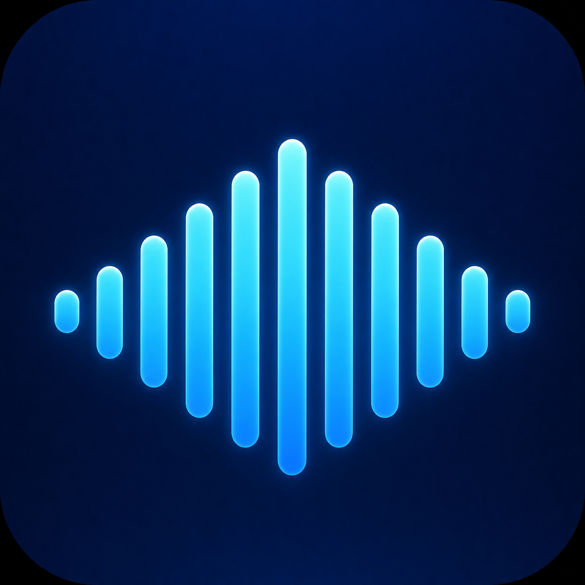

# WhisperDrop

<p align="center">
  
</p>

<p align="center">
  <b>Локальные субтитры для macOS.</b><br>
  Превращает аудио и видео в аккуратные файлы субтитров — без загрузки медиа в облако.
</p>

<p align="center">
  <a href="#русский">Русский</a> · <a href="#english">English</a>
</p>

---

<a id="русский"></a>

## Русский

WhisperDrop — нативное приложение для macOS, которое распознаёт речь в аудио- и видеофайлах и создаёт субтитры на устройстве. Оно построено вокруг OpenAI Whisper Large v3 и особенно задумано как простой инструмент для подготовки субтитров для слабослышащих.

### Что умеет

- Распознаёт речь локально: исходные медиафайлы не отправляются на сервер.
- Принимает видео, аудио или готовые субтитры: перетащите файл в окно приложения.
- Автоматически определяет язык речи.
- Создаёт `.srt`, `.vtt`, `.ass` и `.txt`.
- Позволяет выбрать кодировку; по умолчанию — UTF-8 и SRT.
- По желанию исправляет орфографию, пунктуацию, регистр и лишние пробелы в уже готовых субтитрах. Таймкоды, порядок и число реплик при этом сохраняются.
- Подстраивается под светлую и тёмную тему macOS и использует русский или английский интерфейс в зависимости от языка системы.

### Как это работает

1. При первом запуске приложение предложит скачать модель распознавания **OpenAI Whisper Large v3**. Это наиболее точная доступная модель; она занимает примерно 1,6 ГБ и хранится на Mac.
2. Перетащите видео или аудио в окно WhisperDrop.
3. Дождитесь завершения распознавания. На экране будет круговой индикатор прогресса.
4. Выберите формат и кодировку, если стандартные SRT и UTF-8 вам не подходят.
5. Нажмите «Сохранить субтитры».

Для вычитки субтитров приложение при необходимости отдельно скачает небольшую локальную модель Qwen3 (около 430 МБ). Она необязательна: базовое создание субтитров работает без неё.

### Установка и запуск

Пока приложение готовится к первой публичной версии, его можно собрать из исходного кода:

1. Установите Xcode Command Line Tools и macOS 14 или новее.
2. Склонируйте репозиторий или скачайте его ZIP-архив.
3. В Терминале откройте папку проекта и выполните:

```bash
./script/build_and_run.sh
```

Скрипт соберёт и откроет `WhisperDrop.app`. Готовое приложение находится в `dist/WhisperDrop.app`.

### Приватность и хранение данных

WhisperDrop обрабатывает аудио, видео и текст субтитров только на вашем Mac. В интернет обращается лишь загрузчик моделей, если нужной модели ещё нет. Сами модели хранятся здесь:

```text
~/Library/Application Support/WhisperDrop/Models/
```

Их можно удалить, чтобы освободить место: при следующем использовании приложение снова предложит загрузку. Встроенный токенизатор уже входит в приложение и отдельно пользователю не нужен.

### Требования

- macOS 14 Sonoma или новее.
- Свободное место: около 1,7 ГБ для модели распознавания; ещё около 430 МБ — только если нужна функция вычитки.
- Apple Silicon рекомендуется; локальная вычитка использует Metal для ускорения.

### Статус проекта

Проект находится в активной подготовке к публичному релизу. Перед публикацией будут добавлены страница релизов, адрес репозитория в приложении, лицензия и подписанные сборки.

---

<a id="english"></a>

## English

WhisperDrop is a native macOS app that turns audio and video into subtitle files on your own device. It is built around OpenAI Whisper Large v3 and designed to make accessible subtitle creation simple and private.

### Features

- On-device transcription: your source media is never uploaded to a server.
- Accepts video, audio, or an existing subtitle file — simply drop it onto the app window.
- Automatically detects the spoken language.
- Exports `.srt`, `.vtt`, `.ass`, and `.txt`.
- Lets you choose the text encoding; UTF-8 and SRT are the defaults.
- Optionally proofreads spelling, punctuation, capitalization, and spacing in completed subtitles while preserving every cue's timing, order, and count.
- Follows the macOS light/dark appearance and uses Russian or English according to the system language.

### How it works

1. On first launch, WhisperDrop asks to download **OpenAI Whisper Large v3**. It is the most accurate available model, takes about 1.6 GB, and stays on your Mac.
2. Drop a video or audio file onto the WhisperDrop window.
3. Wait for transcription to finish; progress is shown with a circular indicator.
4. Choose an output format and encoding if the default SRT / UTF-8 combination is not right for your workflow.
5. Click **Save Subtitles**.

If you choose subtitle proofreading, the app may download a separate local Qwen3 model (about 430 MB). It is optional and is not needed for transcription.

### Install and run

The project is currently being prepared for its first public release. You can build it from source in the meantime:

1. Install Xcode Command Line Tools and use macOS 14 or later.
2. Clone the repository or download its ZIP archive.
3. In Terminal, open the project folder and run:

```bash
./script/build_and_run.sh
```

The script builds and opens `WhisperDrop.app`. The packaged app is available at `dist/WhisperDrop.app`.

### Privacy and storage

WhisperDrop processes audio, video, and subtitle text locally on your Mac. It uses the network only to download a missing model. Models are stored here:

```text
~/Library/Application Support/WhisperDrop/Models/
```

You can remove them to free disk space; the app will offer to download them again when needed. The compatible tokenizer is already bundled with the app, so users never have to install it separately.

### Requirements

- macOS 14 Sonoma or later.
- Around 1.7 GB of free space for the transcription model; another 430 MB only when subtitle proofreading is used.
- Apple Silicon is recommended; local proofreading uses Metal acceleration.

### Project status

WhisperDrop is actively being prepared for public release. The release page, in-app repository link, license, and signed builds will be added before publication.

### Development and packaging

Run the test suite:

```bash
swift test
```

Create a distributable archive:

```bash
./script/build_and_run.sh --package
```

The resulting ZIP is suitable for local testing when ad-hoc signed. Public direct distribution requires a Developer ID certificate and notarization; see [`AGENT.md`](AGENT.md) for the release workflow.

---

Made by [@fawkek_obj](https://x.com/fawkek_obj).
